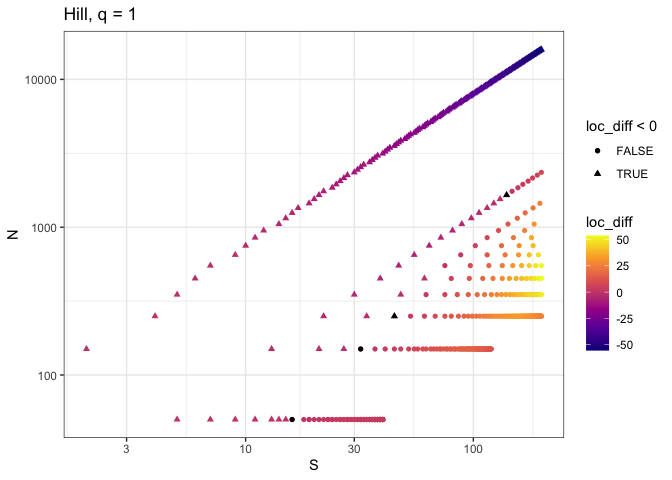
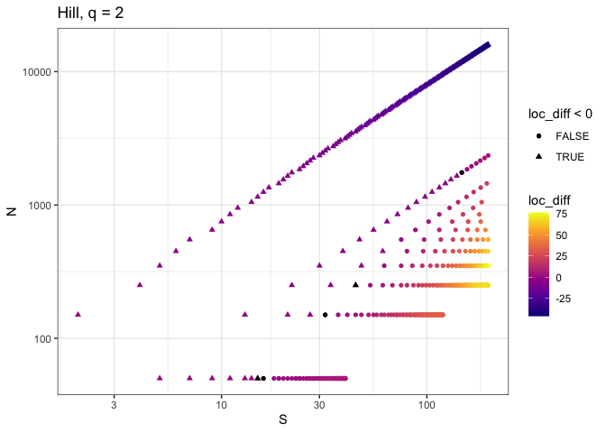

feasible-fishing
================

## Context

This is a summary of research conducted by Renata Diaz as part of NSF
fellowship award DBI-2208901.

## Motivation

From looks at empirical SADs
(e.g. [here](https://github.com/diazrenata/sad-divergence)), we want to
know how “minimally biologically realistic” models compare to a “purely
statistical” model prediction for the SAD.

Two of the major null/neutral frameworks for ecological SADs - the
Maximum Entropy Theory of Ecology (Harte 2011) and Unified Neutral
Theory (Hubbell 2001) predict a logseries SAD at equilibrium. A purely
statistical framework based on combinatorics (the feasible set; Locey
and White 2013) makes predictions that do not align with any
well-characterized mathematical distribution.

Here we examine how the logseries (predicted by minimally-biological
models) compares to predictions from the feasible set over a range of
combinations of S and N.

## Methods

For a range of values of J and v (N, local abundance and speciation
rate), we calculate species richness S and alpha. We then generate draws
from the Fisher logseries for that S, N, and alpha. We also draw samples
from the feasible set for that S and N. We then calculate summary
statistics (Hill numbers of q = 1 and 2) on each SAD. We compare the
distributions of Hill numbers between the logseries and the feasible set
using a Wilcoxon signed rank test.

## Outcomes

These plots show the location difference from the Wilcoxon rank tests,
showing the direction of any difference between the logseries and the
feasible set distributions of the Hill numbers. Negative values mean the
logseries values are *lower* than the values from the feasible set.
Nearly all differences are statistically significant (those that are not
are marked with black points). There is a gradient of transition.
Roughly, for high N/S (upper left side of the plots; points are
triangles), the logseries values are lower than the feasible set. There
is a small region of overlap/non-distinguishability, and then, for low
N/S (lower right side of the plots; points are circles), the logseries
values are higher than the feasible set.

<!-- --><!-- -->

## Interpretation and next steps

First, it is significant that the logseries systematically and
predictably deviates from the feasible set. It means these are not
substitutable “null models”. Moreover, the logseries deviations mirror
those that are found in empirical data (for which high N/S communities
are less even than the feasible set, and low N/S communities are more
even than the feasible set). This tendency suggests that the logseries
lands closer to empirical SADs than does the feasible set (i.e. the
logseries deviates from the feasible set in the same direction as real
data do). This may mean that the logseries, which we can take to be a
“biological” null model, whether it is derived from neutral theory or
MaxEnt, is a discernably more accurate descriptor of biological SADs
than a purely statistical null model. This further suggests that
incorporating even a minimum of biological realism describes a system
that deviates from statistical null models, which may differentiate
ecological systems from other types of complex systems that also show
hollow-curve abundance distributions. Finally, it raises a philosophical
question of what is the appropriate model for characterizing a null or
statistical baseline for an ecological complex system: a
minimally-biological model, such as MaxEnt or UNTB, or a purely
statistical one, such as the feasible set?

## References

Diaz R (2022). *feasiblesads*. R package version 0.0.0.9000.

Harte, J. (2011). Maximum Entropy and Ecology: A Theory of Abundance,
Distribution, and Energetics. Oxford University Press.
<https://doi.org/10.1093/acprof:oso/9780199593415.001.0001>

Hubbell, S. P. (2001). The Unified Neutral Theory of Biodiversity and
Biogeography (MPB-32). Princeton University Press.
<https://www.jstor.org/stable/j.ctt7rj8w>

Landau, W. M., (2021). The targets R package: a dynamic Make-like
function-oriented pipeline toolkit for reproducibility and
high-performance computing. Journal of Open Source Software, 6(57),
2959, <https://doi.org/10.21105/joss.02959>

Li, (2018). hillR: taxonomic, functional, and phylogenetic diversity and
similarity through Hill Numbers. Journal of Open Source Software, 3(31),
1041. <https://doi.org/10.21105/joss.01041>

Locey, K. J., & White, E. P. (2013). How species richness and total
abundance constrain the distribution of abundance. Ecology Letters,
16(9), 1177–1185. <https://doi.org/10.1111/ele.12154>

Prado PI, Miranda MD, Chalom A (2018). *sads: Maximum Likelihood Models
for Species Abundance Distributions*. R package version 0.4.2,
<https://CRAN.R-project.org/package=sads>.
