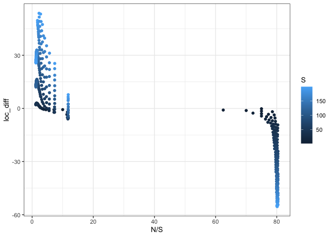
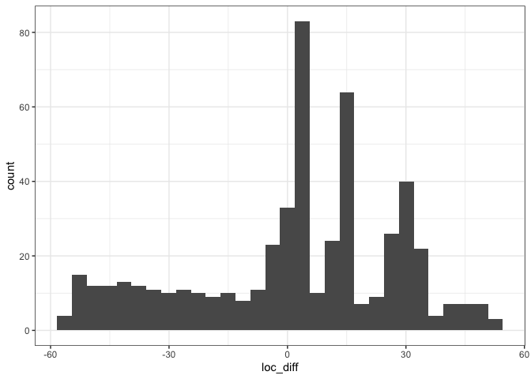

feasible-fishing outcomes
================

``` r
targets::tar_load("all", store = here::here("_targets"))
```

## Hill 1

``` r
hill1 <- filter(all, var == "hill1")

ggplot(hill1, aes(p)) + 
  geom_histogram(bins = 100) +
  geom_vline(xintercept = .05)
```

<!-- -->

``` r
mean(hill1$p < .05)
```

    ## [1] 0.9922631

In nearly all instances (of those sampled) the distribution of hill
numbers for the fs differs from for the logseries.

Note I am not sure if Hill numbers are directly comparable over
variation in S and N.

``` r
ggplot(hill1, aes(S, N, color = loc_diff, shape = loc_diff < 0)) +
  geom_point() +
  scale_color_viridis_c(option = "plasma") +
  scale_x_log10() +
  scale_y_log10() +
  geom_point(data = filter(hill1, p > .05), color = "black") 
```

<!-- -->

``` r
ggplot(hill1, aes(N/S, loc_diff, color = S)) +
  geom_point()
```

<!-- -->

There’s a line where the difference goes from positive to negative. For
high N/S, the difference tends to be less than 0 (logseries has lower
values than the feasible set). For low N/S, the difference tends to be
greater than 0 (logseries has higher values than the feasible set).

``` r
ggplot(hill1, aes(loc_diff)) +
  geom_histogram()
```

    ## `stat_bin()` using `bins = 30`. Pick better value with `binwidth`.

<!-- -->

There’s a gap in these data in N/S.

## Hill 2

``` r
hill2 <- filter(all, var == "hill2")

ggplot(hill2, aes(p)) + 
  geom_histogram(bins = 100) +
  geom_vline(xintercept = .05)
```

<!-- -->

``` r
mean(hill2$p < .05)
```

    ## [1] 0.9903288

In nearly all instances (of those sampled) the distribution of hill
numbers for the fs differs from for the logseries.

Note I am not sure if Hill numbers are directly comparable over
variation in S and N.

``` r
ggplot(hill2, aes(S, N, color = loc_diff, shape = loc_diff < 0)) +
  geom_point() +
  scale_color_viridis_c(option = "plasma") +
  scale_x_log10() +
  scale_y_log10() +
  geom_point(data = filter(hill2, p > .05), color = "black") 
```

<!-- -->

There’s a line where the difference goes from positive to negative. For
high N/S, the difference tends to be less than 0 (logseries has lower
values than the feasible set). For low N/S, the difference tends to be
greater than 0 (logseries has higher values than the feasible set).

``` r
ggplot(hill2, aes(loc_diff)) +
  geom_histogram()
```

    ## `stat_bin()` using `bins = 30`. Pick better value with `binwidth`.

<!-- -->

## Comparison to v

``` r
ggplot(hill1, aes(J, v, color = loc_diff, shape = loc_diff < 0)) +
  geom_point() +
  scale_x_log10() +
  scale_color_viridis_c(option = "plasma")
```

<!-- -->

## Comparison to theta

``` r
hill1 <- hill1 %>%
  mutate(theta =   2 * v * J)

ggplot(hill1, aes(theta, loc_diff)) +
  geom_point()
```

<!-- -->
